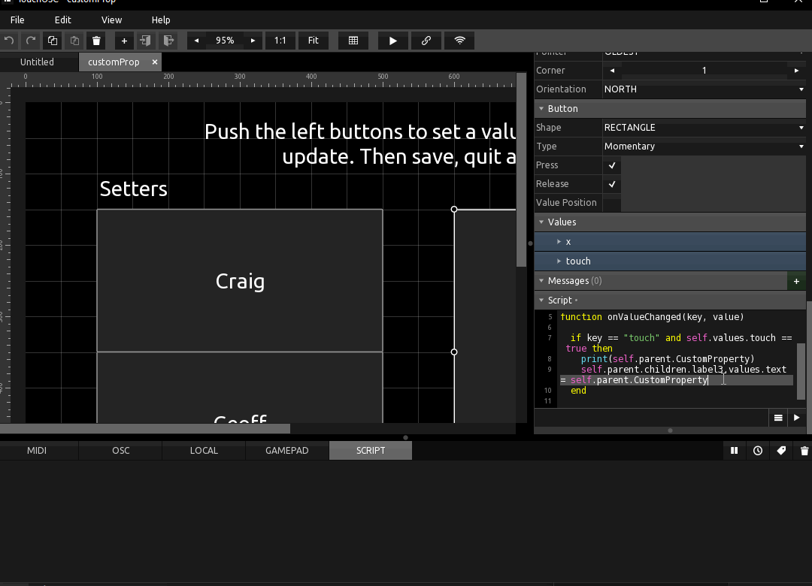
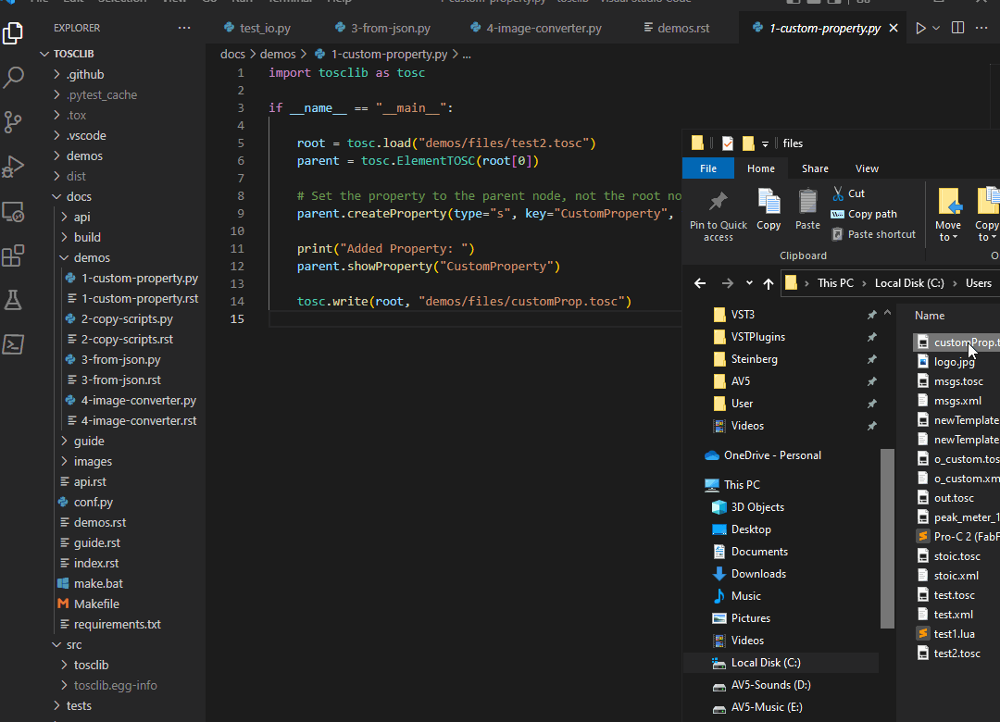

# Custom property

TouchOSC accepts properties it does not recognise, keeps them across a save, and exposes them to Lua. This adds one to a layout's root node.

```python
--8<-- "tests/demos/custom_property.py"
```

Read it back inside the editor:

```lua
function onValueChanged(key, value)
    if key == "touch" and self.values.touch == true then
        print(self.parent.CustomProperty)
        self.parent.CustomProperty = self.parent.children.label2.values.text
    end
end
```

1. Call a script that changes the custom property, then another that sets a label's text from it.

    

2. Save, close, and load the layout again. The label text is still there, because it reads the property on `init`.

    

```lua
function init()
    self.parent.children.label3.values.text = self.parent.CustomProperty
end

function onValueChanged(key, value)
    if key == "touch" and self.values.touch == true then
        self.parent.children.label3.values.text = self.parent.CustomProperty
    end
end
```

See also [Custom properties](../guide/custom-properties.md) in the guide.
