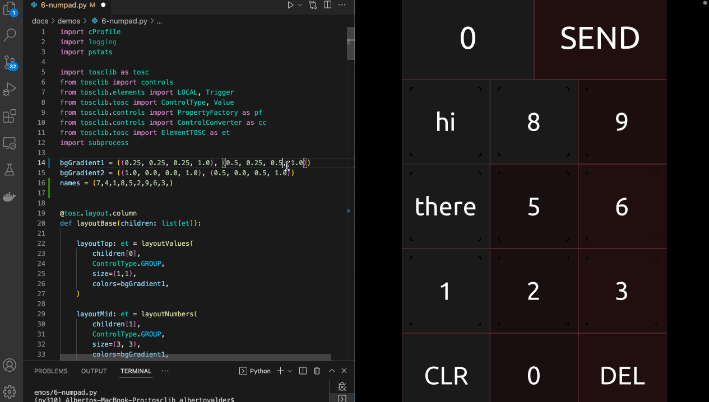

# Numpad

An integer numpad built entirely from Python: nested layouts, a Lua script
carried as a property, and LOCAL messages wiring twelve keys to one readout.

A reconstruction of the numpad module by
[Felix](https://github.com/F-l-i-x/TouchOSC/tree/main/modules/numpad#readme).



Each key is a BUTTON with a non-interactive LABEL on top, so the touch reaches
the button underneath. Pressing a key sends its `name` to the readout's `text`
value over a [`LocalMessage`][py2tosc.LocalMessage]; the readout's script
appends the digit and clamps the running total to its `max` property.

```python
--8<-- "tests/demos/numpad.py"
```

```console
$ python tests/demos/numpad.py
45 controls -> numpad.tosc
```

The demo runs [`validate`][py2tosc.validate] before saving, and the layout it
produces comes back clean.
