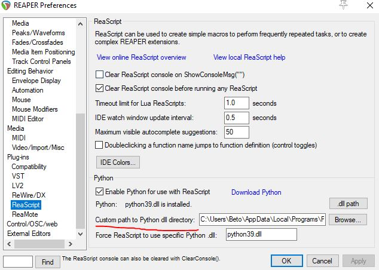
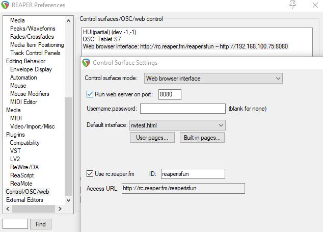

# Reaper to TouchOSC

Ask [REAPER](https://www.reaper.fm/) to run a few scripts over its web interface, ending with a `.tosc` file generated from the parameters of the last touched FX. The result is a layout of faders named after the FX parameters, with OSC messages to match.


## Setup

1. Install REAPER, ReaPack and the SWS extensions.

2. Add this repository to ReaPack:

    ```
    https://raw.githubusercontent.com/AlbertoV5/ReaperTools/master/index.xml
    ```

3. Install all LISZT scripts from AlbertoV5-ReaperTools.

4. Set up Python in REAPER and install `py2tosc` and `aiohttp` into it.

5. Enable the REAPER web interface.

6. Load an FX and run the script.

??? note "Setting up Python in REAPER"

    Find your interpreter:

    ```console
    $ where python
    ```

    Avoid Anaconda environments on Windows -- they have known issues with
    REAPER. Set the path here:

    

??? note "Web interface settings"

    All you need is the port. If you are running the script from another
    machine, change the host to REAPER's IP or use the access URL.

    

## The trigger script

This part talks only to REAPER; the layout itself is generated by the LISZT scripts running inside it.

```python
from dataclasses import dataclass
from hashlib import sha1
from pathlib import Path
import asyncio

import aiohttp


def hash_sha1(action_path: Path) -> str:
    """REAPER's action hashing, as of 6.57. https://askjf.com/index.php?q=6075s"""
    fixed = str(action_path).upper().replace("\\", "/")
    return f"_RS{sha1(fixed.encode()).hexdigest()}"


@dataclass
class Reaper:
    liszt_path: Path = Path("AlbertoV5-ReaperTools") / "liszt"
    host: str = "127.0.0.1"
    port: str = "9500"


async def ping(*actions: str) -> None:
    async with aiohttp.ClientSession() as session:
        for action in actions:
            url = f"http://{Reaper.host}:{Reaper.port}/_/{action}"
            async with session.get(url) as response:
                await response.text(encoding="UTF-8")


if __name__ == "__main__":
    asyncio.run(
        ping(
            hash_sha1(Reaper.liszt_path / "liszt-pull.py"),
            hash_sha1(Reaper.liszt_path / "liszt-generate.py"),
            "_S&M_OPEN_PRJ_PATH",  # optional, needs SWS
        )
    )
```

Write your own version of `liszt-generate.py` to shape the layout however you like.

[LISZT scripts](https://github.com/AlbertoV5/Reaper-Scripts/tree/main/LISZT)
