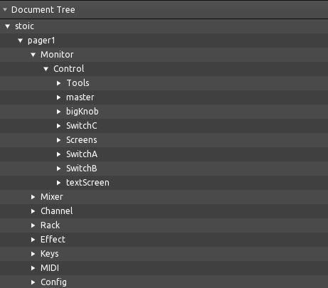
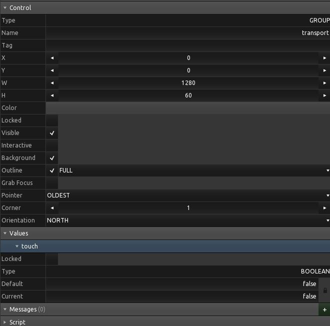

# The .tosc format

TouchOSC compresses an XML tree with zlib and calls the result a `.tosc` file. The editor can read and write every element in that tree, but it only *displays* the ones it has a UI for. This page describes the tree itself, which is useful whether or not you use py2tosc.

Everything here was verified against files written by TouchOSC 1.5.2.262.

## The document

```xml
<?xml version='1.0' encoding='UTF-8'?>
<lexml version='6'>
  <node ID='c36776ac-90b0-11f1-990b-f2a3060a23c2' type='GROUP'>
    ...
  </node>
</lexml>
```

`lexml` is the root and carries a format version. TouchOSC 1.5 writes version `6`; older releases wrote `3`. The root holds exactly one `<node>`, always a `GROUP`, which is the layout's canvas.

Keys and string values are wrapped in `CDATA` sections. Saved `.tosc` files are written as a single line with no whitespace between elements; the editor's `.xml` export is the same document with a newline after every element.

## A node

```
<node>
|__<includes>            (root node only, new in version 6)
|__<properties>
|  |__<property>
|     |__<key>
|     |__<value>
|__<values>
|  |__<value>
|     |__<key>
|     |__<locked>
|     |__<lockedDefaultCurrent>
|     |__<default>
|     |__<defaultPull>
|__<messages>
|  |__<osc>
|  |__<midi>
|  |__<local>
|__<children>
   |__<node>
```

Empty containers are omitted rather than written out: a `LABEL` with no bindings
and no children has neither a `<messages>` nor a `<children>` element. The same
holds inside a message -- one with no triggers has no `<triggers>` element at
all, rather than an empty one.

The editor's tree view shows only the nodes inside each `<children>`:



Everything else appears in the Control, Values, Messages and Script tabs:



Hexler documents the available properties and values in the [scripting reference](https://hexler.net/touchosc/manual/script-properties-and-values).

## Properties

A property is a typed key/value pair. The `type` attribute selects how `<value>` is read:

| Type | Meaning | `<value>` holds |
|------|---------|-----------------|
| `s`  | string  | text |
| `b`  | boolean | `0` or `1` |
| `i`  | integer | text |
| `f`  | float   | text |
| `r`  | frame   | `<x> <y> <w> <h>` |
| `c`  | colour  | `<r> <g> <b> <a>`, each 0.0-1.0 |

```xml
<property type='b'>
  <key><![CDATA[background]]></key>
  <value>1</value>
</property>
<property type='r'>
  <key><![CDATA[frame]]></key>
  <value><x>0</x><y>0</y><w>640</w><h>860</h></value>
</property>
```

Properties are written in alphabetical order by key.

Frame components are **not integers**. TouchOSC positions controls at sub-pixel
offsets, and its own layouts are full of frames like `<x>417.439</x>`. Rounding
them moves the control, so py2tosc keeps them as floats and writes integral
values back without a trailing `.0`.

### Enumerated integers

About a dozen `i` properties hold a number standing for a name. Hexler's manual
lists the names in order but gives no numbers, and the two groups below do not
start from the same one:

| Numbered from 1 | Numbered from 0 |
|-----------------|-----------------|
| `shape`, `textAlignH`, `textAlignV` | `orientation`, `buttonType`, `outlineStyle`, `cursorDisplay`, `barDisplay`, `linesDisplay`, `font`, `response`, `radioType`, `pointerPriority` |

So `shape` 1 is a rectangle and there is no shape 0, while `orientation` 0 is
north. Reading the manual and counting from zero gets the first group wrong.

The split is recoverable from the files themselves: a property numbered from 0
writes a 0 somewhere across a large enough sample, and one numbered from 1 never
can. `shape` confirms it independently -- `hexkeys.tosc` stores its 119
hexagonal buttons as 6, and `HEXAGON` is the sixth name the manual lists.

py2tosc names all of these; see [Named numbers](controls.md#named-numbers).

The root node of a saved layout also carries `metaCreator` and `metaComments`,
which the editor fills in from the document settings.

## Values

A value is the control's live state: `x` and `y` for continuous controls, `touch` for everything, `text` for labels, `page` for pagers.

```xml
<value>
  <key><![CDATA[x]]></key>
  <locked>0</locked>
  <lockedDefaultCurrent>0</lockedDefaultCurrent>
  <default><![CDATA[0]]></default>
  <defaultPull>0</defaultPull>
</value>
```

Booleans in `<default>` are spelled `true` and `false`, not `0` and `1` -- the one place in the format where that is so.

## What changed in version 6

Relative to the version 3 files older tooling produced:

- The root node carries an `<includes>` element. It is empty in every file observed so far, but dropping it changes the document.

- Messages carry a `<noDuplicates>` flag.

- `<connections>` is ten characters wide, one per connection slot. Version 3 used five.

py2tosc reads both. A file keeps the version it was saved with, so editing an older layout will not silently change its format; new documents are version 6. To upgrade an old layout deliberately, set the version before saving:

```python
doc = py2tosc.load("old.tosc")
doc.version = "6"
doc.save("new.tosc")
```
