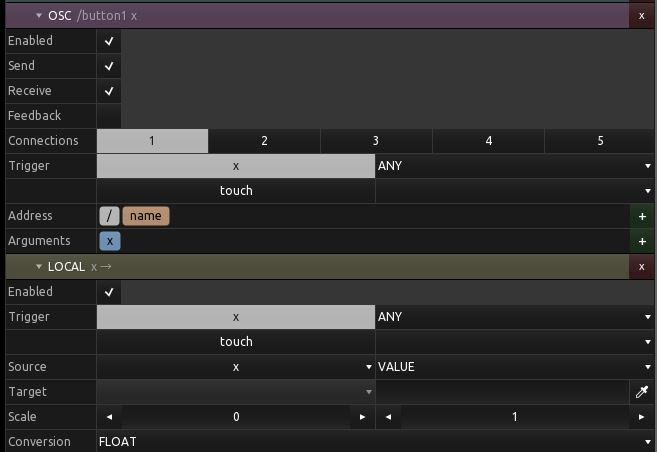
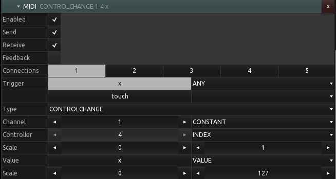

# Messages

A message describes what leaves a control when its state changes. A control can carry any number of them, of any mix of types.

```python
import py2tosc

fader = py2tosc.fader(name="cutoff")
fader.messages.append(py2tosc.OscMessage())
fader.messages.append(py2tosc.MidiMessage())
```



## OSC

[`OscMessage`][py2tosc.OscMessage] defaults to sending the control's `x` value to `/<control name>` on every change, over every connection.

The address and the arguments are both built from [`Partial`][py2tosc.Partial] segments. A partial contributes either a constant, a property of the control, one of its values, or its index within its parent.

```python
from py2tosc import OscMessage, Partial

message = OscMessage(
    path=[
        Partial("CONSTANT", "STRING", "/"),
        Partial("PROPERTY", "STRING", "parent.name"),
        Partial("CONSTANT", "STRING", "/"),
        Partial("PROPERTY", "STRING", "name"),
    ],
    arguments=[
        Partial("VALUE", "FLOAT", "x", scale_min=0, scale_max=127),
    ],
)
```

That builds `/<parent name>/<control name>` with the fader position scaled to 0-127.

The XML it produces:

```
<osc>
|__<enabled>
|__<send>
|__<receive>
|__<feedback>
|__<noDuplicates>
|__<connections>
|__<triggers>
|  |__<trigger>
|     |__<var>
|     |__<condition>
|__<path>
|  |__<partial>
|     |__<type>
|     |__<conversion>
|     |__<value>
|     |__<scaleMin>
|     |__<scaleMax>
|__<arguments>
   |__<partial>
```

## MIDI



[`MidiMessage`][py2tosc.MidiMessage] pairs a [`MidiCommand`][py2tosc.MidiCommand] -- the status bytes -- with three [`MidiValue`][py2tosc.MidiValue] slots that supply the data.

```python
from py2tosc import MidiCommand, MidiMessage, MidiValue

message = MidiMessage(
    message=MidiCommand("CONTROLCHANGE", channel=0, data1=74),
    values=[
        MidiValue("CONSTANT", "", 0, 15),
        MidiValue("INDEX", "", 0, 1),
        MidiValue("VALUE", "x", 0, 127),
    ],
)
```

```
<midi>
|__<enabled>
|__<send>
|__<receive>
|__<feedback>
|__<noDuplicates>
|__<connections>
|__<triggers>
|__<message>
|  |__<type>
|  |__<channel>
|  |__<data1>
|  |__<data2>
|__<values>
   |__<value>
      |__<type>
      |__<key>
      |__<scaleMin>
      |__<scaleMax>
```

!!! note "Fixed in py2tosc"

    tosclib 0.3.x wrote MIDI bindings with a trigger's fields in place of the
    status bytes, and used a `<midivalue>` tag the format does not define. Any
    MIDI binding it produced was invalid.

## Local

[`LocalMessage`][py2tosc.LocalMessage] sends to another control in the same layout rather than out over the network. It needs the destination's id:

```python
from py2tosc import LocalMessage

readout = doc.find("readout")
fader.messages.append(
    LocalMessage(value="x", dst_type="FLOAT", dst_var="text", dst_id=readout.id)
)
```

```
<local>
|__<enabled>
|__<triggers>
|__<type>
|__<conversion>
|__<value>
|__<scaleMin>
|__<scaleMax>
|__<dstType>
|__<dstVar>
|__<dstID>
```

## Gamepad

[`GamepadMessage`][py2tosc.GamepadMessage] binds a game controller button or axis to one of the control's values. It is the one one-directional binding: the controller drives the control, so there are no triggers and nothing to send.

```python
from py2tosc import GamepadMessage

fader.messages.append(
    GamepadMessage(type="AXIS_LEFT_Y", target_var="x", scale_min=0, scale_max=1)
)
```

```
<gamepad>
|__<enabled>
|__<connections>
|__<type>
|__<conversion>
|__<scaleMin>
|__<scaleMax>
|__<targetType>
|__<targetVar>
```

## Triggers

Every message carries [`Trigger`][py2tosc.Trigger] entries saying what causes it to fire. The default fires on any change to `x`.

```python
from py2tosc import OscMessage, Trigger

# only when the control is touched, and only on the press
OscMessage(triggers=[Trigger(var="touch", condition="RISE")])
```

## Connections

`connections` is one character per connection slot, `1` for enabled. TouchOSC 1.5 has ten slots, and the default enables all of them.

```python
OscMessage(connections="1000000000")   # first connection only
```
